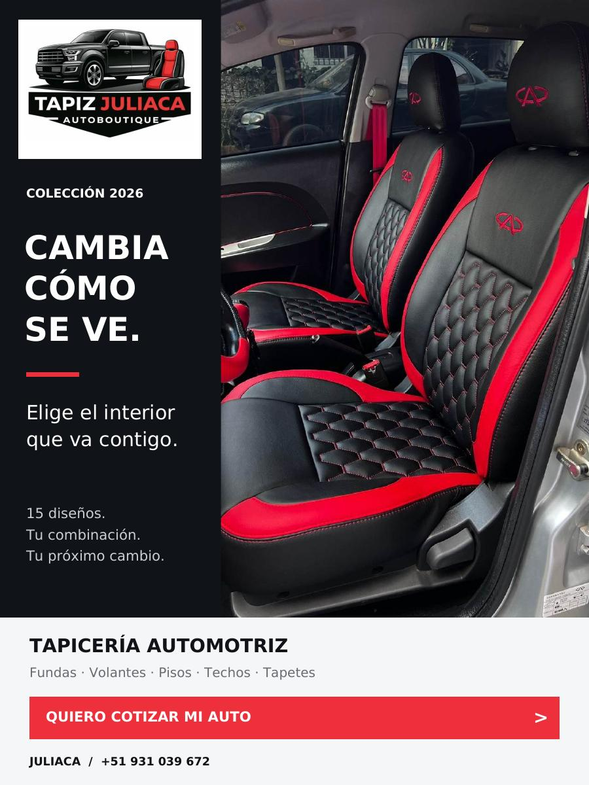

# Configurador 3D de Tapizado Vehicular — Three.js + Vite | Tapiz Juliaca Autoboutique

Personaliza el **tapizado de asientos de auto en 3D y en tiempo real**: elige diseño, colores, costura y material sobre un modelo GLB modelado en Blender, y envía tu configuración por WhatsApp para cotizar.

Proyecto web del configurador 3D de **[Tapiz Juliaca Autoboutique](https://wa.me/51931039672)** (Juliaca, Perú), una tapicería automotive que permite ver el resultado del tapizado antes de comprarlo, eliminando las dudas entre la muestra física y el resultado final instalado en el vehículo.



---

## Características

- **Visualización 3D en tiempo real** con `THREE.WebGLRenderer`, sombras suaves, tone mapping ACES y luces PBR (key, rim, fill y hemisférica).
- **OrbitControls** con damping, giro automático, límites de ángulo/distancia y zoom con rueda del mouse.
- **4 diseños de tapizado** con textura generada por canvas en tiempo real: Rombo Andino, Titicaca, Mantaro y Original.
- **3 zonas de aplicación**: asiento completo, panel central o solo laterales.
- **Paleta de colores independiente** para color principal, contraste y costura.
- **4 acabados de material** (cuero, pranna, detroit, cuero natural) que cambian `roughness`, `clearcoat`, `clearcoatRoughness` y relieve de la superficie.
- **Modelos GLB exportados desde Blender** con materiales separados por zona, re-mapeados por nombre (`MAT_CUERO_MARFIL`, `MAT_PANEL_MARFIL`, `MAT_CONTRASTE_GRAFITO`, `MAT_COSTURA_CLARA`) para que el customization funcione sobre el asset real y no solo sobre la geometría procedural.
- **Geometría procedural de respaldo** (`ExtrudeGeometry` + `RoundedBoxGeometry`) que se usa si el GLB no carga, para que la demo nunca quede en blanco.
- **Cotización por WhatsApp** con un mensaje pre-armado que incluye vehículo, año, diseño, material, colores, costura y zona elegida.
- **Sitio responsive y accesible**: navegación por teclado, `aria-label`, `aria-pressed`, `<dialog>` nativo y respeto de `prefers-reduced-motion`.

## Stack

| Capa | Tecnología |
| --- | --- |
| Render 3D | Three.js `^0.180.0` (WebGL2) |
| Build / dev server | Vite `^7.1.7` |
| Lenguaje | JavaScript ES modules, HTML5, CSS3 |
| 3D assets | Blender → `.glb` (glTF 2.0) |
| Lead / cotizaciones | WhatsApp Business |

Sin backend: es una aplicación estática, todo el estado de la configuración vive en el cliente.

## Instalación

```bash
git clone https://github.com/HEYLER1/tapizado-3d-configurator.git
cd tapizado-3d-configurator
npm install
npm run dev
```

La app queda disponible en `http://localhost:5173`.

## Scripts

| Comando | Descripción |
| --- | --- |
| `npm run dev` | Servidor de desarrollo con HMR, expuesto en `0.0.0.0` para probar en el celular dentro de la misma red. |
| `npm run build` | Build de producción en `dist/`. |
| `npm run preview` | Sirve localmente el build de `dist/`. |

## Modelos 3D

El proyecto incluye dos modelos, ambos derivados de un asiento de referencia y editados en Blender:

| Modelo | Archivo | Vista |
| --- | --- | --- |
| Asiento premium | `public/models/tapiz_asiento_premium.glb` | Por defecto |
| Adaptación Hilux | `public/models/tapiz_hilux_sentadera.glb` | `?modelo=hilux` |

Para abrir la adaptación para pickup:

```
http://localhost:5173/?modelo=hilux
```

Los `.blend` originales están en `assets/` y los previews en PNG, por si se quiere re-exportar:

```bash
# desde Blender: File > Export > glTF 2.0
# o por consola de Python en Blender
import bpy
bpy.ops.export_scene.gltf(filepath='public/models/tapiz_asiento_premium.glb', export_format='GLB')
```

Al re-exportar, mantén los nombres de material indicados arriba: de ahí depende que los colores del configurador se apliquen a la malla correcta.

## Estructura

```
.
├── index.html              # UI del configurador, diálogo de cotización, catálogo
├── src/
│   ├── main.js             # Escena 3D, estado de configuración, texturas, eventos
│   └── style.css           # Estilos del layout y controles
├── public/
│   ├── models/             # Assets GLB de producción
│   ├── catalogo-2026.jpg   # Imagen de la colección
│   └── Catalogo_Tapiz_Juliaca_2026.pdf   # Catálogo imprimible
├── assets/                 # Archivos .blend originales y previews
└── vite.config.js          # Configuración de build
```

## Cómo funciona la personalización

1. `state` (en `src/main.js`) es la única fuente de verdad: diseño, colores, costura, material y zona.
2. Al cargar el GLB, `GLTFLoader` recorre la jerarquía y separa las mallas en cuatro grupos según el **nombre del material**.
3. `updateSeat()` aplica color y textura solo a los grupos que corresponden a la zona seleccionada.
4. `textureFor()` dibuja el patrón en un `<canvas>` 2D y lo devuelve como `CanvasTexture`, así los rombos, paneles y costuras cambian sin recargar nada.
5. `setMaterialFinish()` traduce el material elegido a parámetros PBR, y los aplica tanto a los materiales del GLB como a los procedurales.
6. `render()` corre en un `requestAnimationFrame` continuo mientras el modelo esté en pantalla.

## Palabras clave

`configurador 3D` `tapizado 3D` `tapicería automática` `forro de asientos` `asientos de cuero 3D` `three.js` `webgl` `modelado 3D` `blender` `glb` `gltf` `tapizado de autos` `cotizador 3D` `ecommerce automotive` `vite` `javascript`

## Licencia

Apache License 2.0 — ver [LICENSE](LICENSE).

Los modelos 3D incluidos son trabajo original de Tapiz Juliaca Autoboutique. Para uso comercial, industrial o redistribución, contacta por WhatsApp: [+51 931 039 672](https://wa.me/51931039672).
